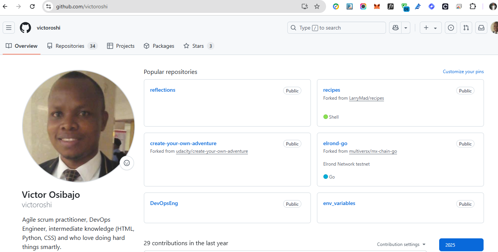
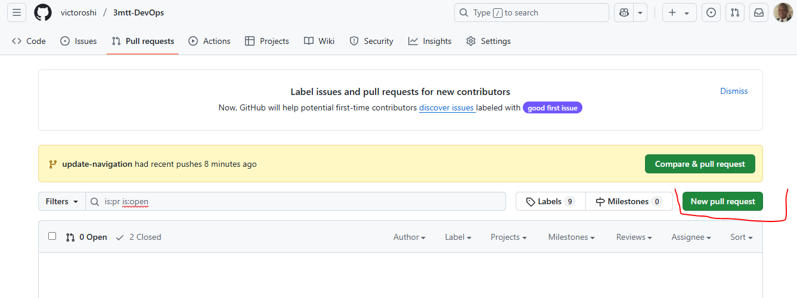
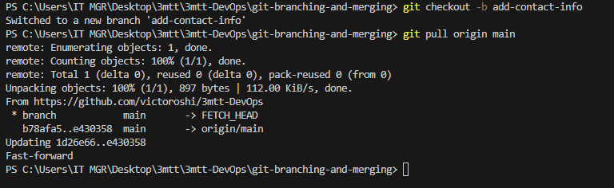
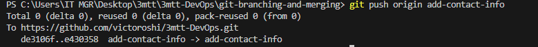

# Git Branching and Merging
Emerging you have 2 users Tom and Jerry who have pushed their changes from different branches to the repo, yourself or another teanm member can view and merge these changes to the main project. This process usually involves 

1.  Creating a pull request
2.  Merging the pull request into the main branch

## Understanding Pull Request
A pull request is a way to propose changes you've made in a branch to be merged into another branch, typically the main branch. It’s commonly used for code review, collaboration, and team workflows on platforms like GitHub, GitLab, and Bitbucket.

### How to create a pull request on GitHub
After both Tom and Jerry have pushed their work to their respective branches, the next step is to create a pull request for each of them. Here's how Tom would create a pull request for his changes:

a.  Open your web browser and go to the GitHub page for the repository.
b.  Click on the branch dropdown menu near the top left corner of the file list and select the branch Tom have been working on, in this case, **update-navigation** branch as show below

## Create New Pull request

The dialog box below shows how to delete the existing branches and create new one

### How to Create a Pull Request on GitHub
Emrging we have two users named Tom and Jerry, after both of them have pushed their work to their respective branches, the next step is to create a pull request for each of them. Here's how Tom working on the update-navigation branch would create a pull request for his changes:

## Login to GitHub, this screenshot show the dashboard

### Navigate to Your GitHub Repository
1.  From the GitHub dashboard page, click on the repository and select the project folder that host your content
2.  Click on the branch dropdown menu near the top left corner of the file list and select the branch Tom have been working on, in this case, the **update-navigation** branch
3. Click the "New pull request" button next to the branch dropdown menu as shown in the screenshot below

    

4.  GitHub will take you to a new page to initiate a pull request. It automatically selects the **main**  project's branch as the base and your recently pushed branch as the compare branch.
5.  Before creating the pull request, Tom would review his changes to ensure everything is correct. GitHub shows the differences between the base branch and Tom's branch. It's a good opportunity for Tom to double-check his work.
6.  If everything looks good, click the **"Create pull request"** button
7.  Provide a title and description for the pull request. The title should be concise and descriptive, and the description should explain the change that the pull request is about, why it's needed, and any other relevant details.
8.  After filling in the information, click **"Create pull request"**  again to officially open the pull request.

### Reviewing and Merging Tom's Pull Request
Once the pull request is created, it becomes visible to other team members who can review the changes, leave comments, and request additional modifications if necessary (This is an example of what collaboration is about in DevOps). When the team agrees that the changes are ready and good to go, someone with merge permissions can merge the pull request, incorporating the changes from Tom's **update-navigation**  branch into the main branch.

### Updating Jerry's Branch with Latest Changes
Before Jerry merges his changes into the main branch, it's essential to ensure his branch is up-to-date with the main branch. This is because other changes (like Tom's updates) might have been merged into the main branch after Jerry started working on his feature. Updating ensures compatibility and reduces the chances of conflicts.

#### Steps to Update Jerry's Branch:
1.  On the terminal, Switch to Jerry's Branch 
2.  `git checkout -b add-contact-info`
3.  `git pull origin main`

Purpose: This command fetches the changes from the **main branch** Remember, main branch now has Tom's changes and merges them into Jerry's **add-contact-info**  branch. It ensures that any updates made to the main branch, like Tom's merged changes, are now included in Jerry's branch. This step is crucial for avoiding conflicts and ensuring that Jerry's work can smoothly integrate with the main project.

### Finalizing Jerry's Contribution
Assuming there are no conflicts, Jerry's branch is now ready to be merged back into the main project.

#### Push the Updated Branch to GitHub:
`git push origin add-contact-info`
This command uploads Jerry's changes to GitHub. Now, his branch reflects both his work and the latest updates from the main branch.

The **origin**  keyword in the command refers to the default name Git gives to the remote repository from which you cloned your project. It's like a shortcut or an alias for the full URL of the repository in GitHub.

*Create the Pull Request (PR) for Jerry's changes, similar to how you did for Tom.*
*Merge Jerry's Pull Request. Complete the process by merging the PR into the main branch.*

This simulated workflow illustrates how Git facilitates collaborative development, allowing multiple developers to work simultaneously on different aspects of a project and merge their contributions seamlessly, even when working on the same files.