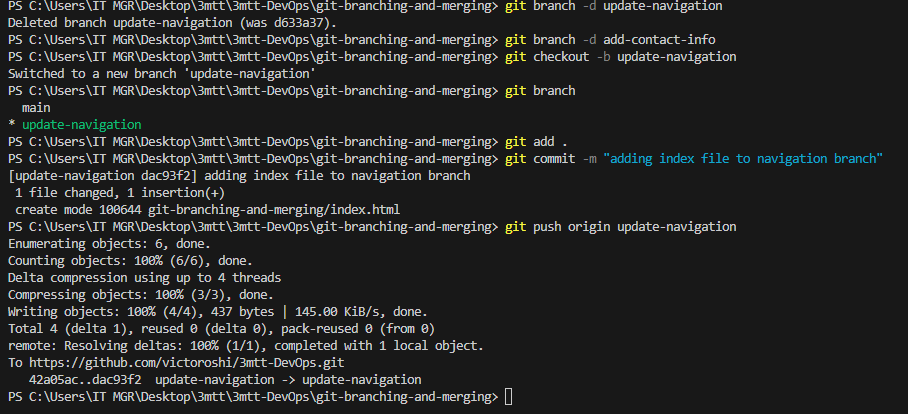

# Git Branching and Merging
Emerging you have 2 users Tom and Jerry who have pushed their changes from different branches to the repo, yourself or another teanm member can view and merge these changes to the main project. This process usually involves 

1.  Creating a pull request
2.  Merging the pull request into the main branch

## Understanding Pull Request
A pull request is a way to propose changes you've made in a branch to be merged into another branch, typically the main branch. It’s commonly used for code review, collaboration, and team workflows on platforms like GitHub, GitLab, and Bitbucket.

### How to create a pull request on GitHub
After both Tom and Jerry have pushed their work to their respective branches, the next step is to create a pull request for each of them. Here's how Tom would create a pull request for his changes:

a.  Open your web browser and go to the GitHub page for the repository.
b.  Click on the branch dropdown menu near the top left corner of the file list and select the branch Tom have been working on, in this case, **update-navigation** branch as show below

## Create New Pull request

The dialog box below shows how to delete the existing branches and create new one

## Windows Installation:
Download Git: go to https://git-scm.com/download/win On the web page, Click "Download" to download the #### Git installer for Windows.

### Run installer
Locate the downloaded .exe file, Double-click to run the installer.  Click install to complete the installation. When installation is complete click FINISH to complete the installation.
If your installation is successful, it will have the following look after launching: It might be slightly different, but does not matter.

## Launch Git
Open Terminal and type git --version on the CLI and press Enter to verify that Git has been installed.
If your installation is successful, it will have the following look after launching: It might be slightly different, but does not matter.

### Configuration of User credentials in Git
Set Global username, type the follwoing command

`git config --global user.name "Victor Osibajo"`

Set Global Email Address
`git config --global user.email "vicoma@gmail.com"`

Verify the Configuration

`git config --global --list`

## My GitHub Dashboard

### As show below screnshot, I have login to my account, click on repository to create new one

Clicking on **New** or the + icon will display a dialog box to create a new repository as shown in the image below, eneter the appropriate name with optional description and make sure it is set to public for others to be able to view your project

Click on the **Code** button from the New Repository page that was just created and copy the HTTPS URL as shown below:

**To show how version control system work, I have demonstrated it by creating some files with index.html which holds the home page content**

I have created a repository with the name mimi-project-git-version-control and I have clone it to my local machine using the command *git clone https://github.com/victoroshi/3mtt-DevOps.git* as sown in the screenshot below

### navigate to the new folder clonned locally
cd mtt-DevOps/mini-project-git-version-control

I created 3 new files inside the folder named mini-project-git-version-control as described below:
1.  index.html → Main HTML file
2.  style.css → CSS for styling
3.  README.md → Documentation

inside my index.html file, I have this content just for a start
*This is the Admin creating an index.html file for Tom and Jerry.*

*To check the changes that has not been staged type*

`git status`

To stage the changes, type

`git add index.html`

confirmed that the changes has been staged for committ

`git status`

This time arround, the file name will appear in green color meaning the file(s) has been successfuly staged as shown in the following diagram

To commit the changes, the following command is used

`git commit -m "Adding index.html file`

To put the main branch to GitHub, use this

`git push origin main`

Add Files to Staging Area ,before committing changes, we must add them to the staging area, where Git keeps track of them by using the following command

`git add .`

### Create Initial Commit 
A commit saves all staged changes in the Git history.

`git commit -m "adding navigation to index.html"`

### Push the current files that have been staged to GitHub

### Creating new branch called update-navigation

`git checkout -b update-navigation`

## Merging update-navigation Branch into Main branch.
Merge is used to combine the changes from one branch into the another. Creates a merge commit, recording the history of both branches.

Rebase (git rebase update-navigation) : Moves commits from update-navigation on top of main. Does not create a merge commit instead, it rewrites commit history.

### To push the current branch and set the remote as upstream, use this command
*git push --set-upstream origin update-navigation*

also decribed in the following screenshot

### To create the second branch, we need to pull the updated to our local reporitory by following these commands
git checkout main

git pull origin main

Next step is to add the *add-contact-info* by typing the following command

`git checkout -b add-contact-info`

This will create a branch where Jerry will make his changes keeping them separate from the main branch until they are ready to be merged. 

From this new branch, I will open the index.html file and add the contact information. After adding the contact info, I will enetr the following commands to stimulate Jerry's task

`git add index.html`

The command above stages the changes Jerry made to the index.html file prepaing them for commit. 

To commit the changes, I will perfom the following commands

`git commit -m "Add contact information"`  which saves Jerry's changes in the branch history with a message with what was done

The next thing is to push what was done by Jerry to the GitHub

`git push origin add-contact-info`

Updated index.html (with Contact Info Section)

This URL is where I hosted all the file in the repository confirming that the repository contain an index.html file
