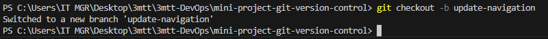

#Git Version Control
Git is a version control system that helps us manage our code efficiently. It consists of different areas, including the working directory and the staging area. Any changes to the code, such as editing, testing, and packaging, can be tracked using Git

**To show how verson control system work, I have demonstrated it by creating some files with index.html which holds the home page content**

I have created a repository with the name mimi-project-git-version-control and I have cloned it to my local machine using the command *git clone https://github.com/victoroshi/3mtt-DevOps.git* as sown in the screenshot below

 I created 3 new files inside the folder named mini-project-git-version-control as described below:
1.  index.html → Main HTML file
2.  style.css → CSS for styling
3.  README.md → Documentation

Add Files to Staging Area ,before committing changes, we must add them to the staging area, where Git keeps track of them by using the following command

*git add .*

### Create Initial Commit 
A commit saves all staged changes in the Git history.

*git commit -m "adding index.html, style.css and updating README.md"* and **git push** to upload local repository content to a remote repository as shoen in the picture below

### Create and Switch to a New Branch.
Branching allows working on a new feature without affecting the main code.

To demonstrate how Git version contro work, I will create **two branches** using the following command

*git checkout -b update-navigation* as shown below

