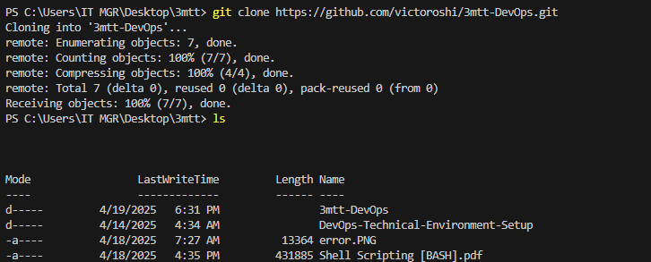
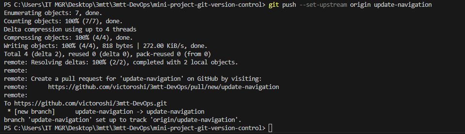

#Git Version Control
Git is a version control system that helps us manage our code efficiently. It consists of different areas, including the working directory and the staging area. Any changes to the code, such as editing, testing, and packaging, can be tracked using Git

**To show how verson control system work, I have demonstrated it by creating some files with index.html which holds the home page content**

I have created a repository with the name mimi-project-git-version-control and I have clone it to my local machine using the command *git clone https://github.com/victoroshi/3mtt-DevOps.git* as sown in the screenshot below

 I created 3 new files inside the folder named mini-project-git-version-control as described below:
1.  index.html → Main HTML file
2.  style.css → CSS for styling
3.  README.md → Documentation

Add Files to Staging Area ,before committing changes, we must add them to the staging area, where Git keeps track of them by using the following command

*git add .*

### Create Initial Commit 
A commit saves all staged changes in the Git history.

*git commit -m "adding index.html, style.css and updating README.md"*

## Merging update-navigation Branch into Main branch.
Merge is used to combine the changes from one branch into the another. Creates a merge commit, recording the history of both branches.

Rebase (git rebase update-navigation) : Moves commits from update-navigation on top of main. Does not create a merge commit instead, it rewrites commit history.

### To push the current branch and set the remote as upstream, use this command
*git push --set-upstream origin update-navigation*

also decribed in the following screenshot

### To create teh second branch, we need to pull the updated to our local reporitory by following these commands
git checkout main
git pull origin main

Next step is to add the *add-contact-info* by typing the following command

*git checkout -b add-contact-info*

Updated index.html (with Contact Info Section)
